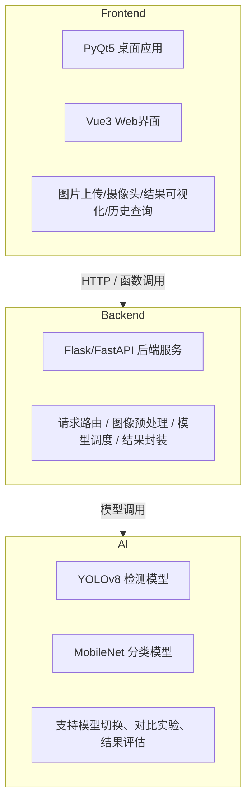

```mermaid
flowchart TD
    Frontend[前端展示层]
    Backend[业务逻辑层]
    AI[AI推理层]

    subgraph Frontend
        A1[PyQt5 桌面应用]
        A2[Vue3 Web界面]
        A3[图片上传/摄像头/结果可视化/历史查询]
    end

    subgraph Backend
        B1[Flask/FastAPI 后端服务]
        B2[请求路由 / 图像预处理 / 模型调度 / 结果封装]
    end

    subgraph AI
        C1[YOLOv8 检测模型]
        C2[MobileNet 分类模型]
        C3[支持模型切换、对比实验、结果评估]
    end

    Frontend -- "HTTP / 函数调用" --> Backend
    Backend -- "模型调用" --> AI
```
